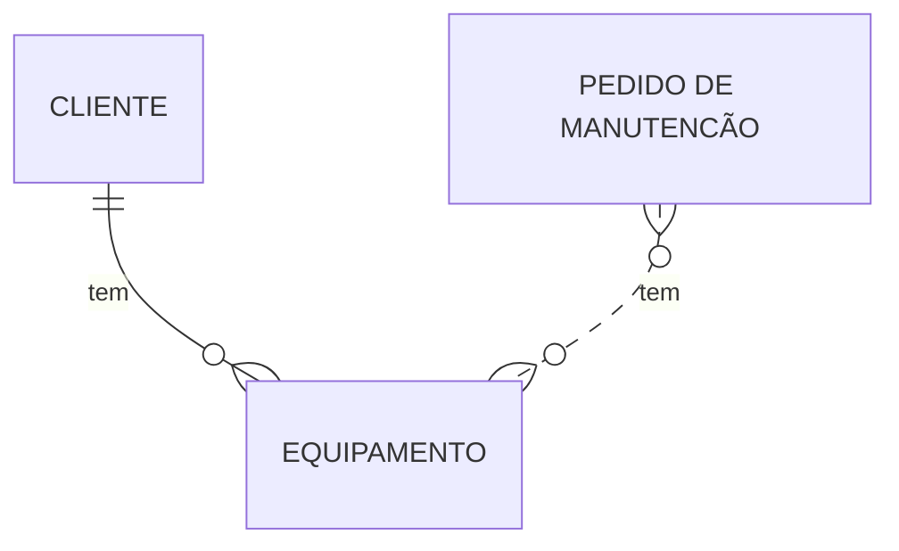
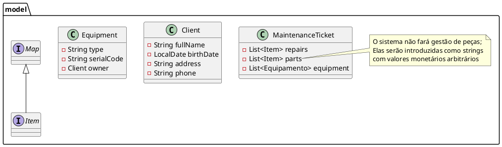

# Diagrama entidade-relacionamento

```mermaid
erDiagram
    CLIENTE ||--o{ EQUIPAMENTO : tem
    "PEDIDO DE MANUTENCÃO" }o..o{ EQUIPAMENTO : tem
```

# Diagrama de classes

```plantuml
@startuml

package model {

    class Client {
        - String fullName
        - LocalDate birthDate
        - String address
        - String phone
    }

    class Equipment {
        - String type
        - String serialCode
        - Client owner
    }

    class MaintenanceTicket {
        - List<Item> repairs
        - List<Item> parts
        - List<Equipamento> equipment
    }

    note right of MaintenanceTicket::parts
        O sistema não fará gestão de peças;
        Elas serão introduzidas como strings
        com valores monetários arbitrários
    end note

    interface Item extends Map<String, BigDecimal> {
    }

}

@enduml
```
